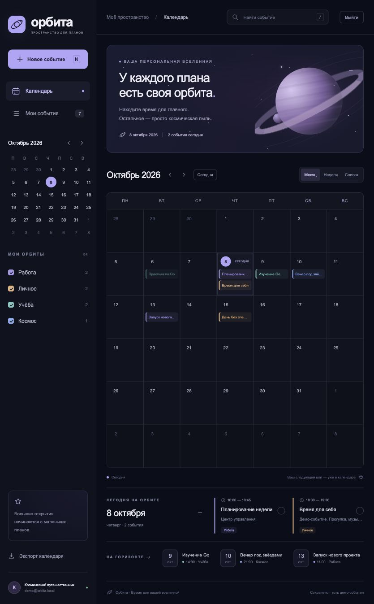

# Орбита — космический календарь на Go

Календарь с личными аккаунтами, PostgreSQL и обработкой событий через RabbitMQ.
Go-сервер реализует требования пяти лабораторных работ; расширенный стенд включает
отдельный обработчик, Prometheus, Grafana и сервис нагрузки. Интерфейс сохраняет
космическую тему и встроен в сервер через `go:embed`.



## Запуск учебного стенда

Нужны Docker с Compose и Python 3 для генерации локальных секретов. Go на хосте
для этого способа не требуется: Docker собирает приложение с Go 1.27.1.

```bash
git clone https://github.com/AndreySvistunovHSEMIEM/calendar.git
cd calendar
./scripts/init-env.sh
docker compose up -d --build
```

| Сервис | Адрес | Доступ |
|---|---|---|
| Календарь | http://127.0.0.1:8080 | Создать аккаунт в интерфейсе |
| Grafana | http://127.0.0.1:3000/d/orbita-overview | Пользователь `orbita`, пароль `GRAFANA_PASSWORD` из `.env` |
| Prometheus | http://127.0.0.1:9090 | Локальный просмотр метрик |
| RabbitMQ Management | http://127.0.0.1:15672 | Пользователь `orbita`, пароль `RABBITMQ_PASSWORD` из `.env` |

Скрипт создаёт `.env` с новыми случайными паролями и ключом JWT; повторный запуск
сохраняет существующие значения. `.env`, базы, локальные JSON и промежуточные
проверки исключены из Git. PostgreSQL и AMQP доступны внутри сети Compose;
пользовательские интерфейсы опубликованы на `127.0.0.1`.

Для демонстрационных событий установить `DEMO_ENABLED=true` в `.env` и выполнить
`docker compose up -d api`. Будет создан аккаунт `demo@orbita.local` с паролем
`OrbitaDemo2026!` и семь примеров относительно даты первого запуска. Это общий
учебный аккаунт; для личных событий создайте собственный. Повторный запуск не
заполняет аккаунт заново. Примеры наблюдений не являются астрономическим прогнозом.

Остановка с сохранением данных: `docker compose stop`. Повторный запуск:
`docker compose up -d`. Данные PostgreSQL, RabbitMQ и Grafana находятся в именованных
томах. `docker compose down` удаляет контейнеры, но сохраняет тома; флаг `-v` удаляет
данные и для обычной остановки не нужен.

## Быстрый локальный просмотр

Нужен Go 1.26 или новее. JSON — дополнительный адаптер для просмотра без контейнеров;
для сдачи лабораторной работы с PostgreSQL используйте стенд выше.

```bash
./start.sh -storage json -demo
```

Открыть http://127.0.0.1:8080 и войти в демо-аккаунт. На macOS тот же режим запускает
`start.command`. Скрипт находит Go в `PATH` или в `~/.cache/space-calendar/go/bin/go`.
Остановка — `Ctrl+C`. Новый локальный файл — `data/calendar.json`, ключ JWT —
`data/calendar.json.key`, оба с правами `0600`. JSON содержит пользователей, хэши
паролей, сессии и события с владельцем. Изменения записываются через временный файл
и `rename`; отказ записи не изменяет состояние в памяти.

Старый `data/events.json` первой версии остаётся нетронутым. Он не импортируется
автоматически в чужой аккаунт. JSON и PostgreSQL — разные хранилища, они не
синхронизируются. Для одного JSON-файла допускается один серверный процесс.

## Работа с календарём

- Месяц, неделя, список за месяц и список всех своих событий.
- Выбор даты, мини-календарь, переходы и кнопка «Сегодня».
- Создание, изменение, удаление и восстановление последнего удалённого события,
  пока уведомление «Отменить» доступно на странице.
- Событие на весь день или с началом и окончанием в пределах одного дня.
- Название, описание, место, категория и пользовательская отметка о завершении.
- Орбиты «Работа», «Личное», «Учёба», «Космос», поиск по всем своим датам.
- События выбранного дня и три ближайших незавершённых плана.
- Экспорт только своих событий в iCalendar, независимо от фильтров.
- Регистрация, вход, восстановление сессии после обновления страницы и выход.
- Мобильная вёрстка, звёздный фон и планета с кольцами средствами CSS/SVG.

`N` / `Т` открывает создание, `/` — поиск, `Escape` закрывает диалог. Двойной клик
по свободному месту дня открывает создание на эту дату. Стрелки на кнопке даты
перемещают выбор на день или неделю.

## Соответствие заданию

Подробная сверка исходных файлов находится в [карте требований](docs/requirements.md).
Заказы учебного примера адаптированы как события календаря.

| Уровень методички | Реализация |
|---|---|
| ЛР1 | `/test` → Handler → Usecase → Repository; graceful shutdown |
| ЛР2 | PostgreSQL, инициализация таблиц, POST `/dbtest` |
| ЛР3 | Регистрация, bcrypt, вход, JWT, сессии в БД |
| ЛР4 | Создание событий и просмотр собственных событий и их статусов |
| ЛР5 | Middleware проверяет JWT и сессию, передаёт владельца в контекст |
| 6–7 | Отдельный worker, RabbitMQ, обратная очередь статусов |
| 8 | Docker Compose, JSON-логи, метрики Prometheus и панели Grafana |
| 9–10 | Отдельный сервис нагрузки и сохранённый результат прогона |

Статус обработки `pending → ready` относится к подготовке события. Поле
`completed` меняет сам пользователь; обработчик не отмечает реальные планы
выполненными. JSON-режим сразу возвращает `ready`; асинхронный обмен работает в
PostgreSQL-стенде с `RABBITMQ_URL`.

## API и авторизация

| Метод | Путь | Доступ |
|---|---|---|
| GET | `/test` | Публичный, точная строка `Hello!` |
| GET | `/healthz`, `/readyz`, `/metrics` | Проверка процесса, БД и метрик |
| POST | `/api/auth/register` | `name`, `email`, `password` |
| POST | `/api/auth/login` | `email`, `password` |
| GET | `/api/auth/me` | Текущий пользователь |
| POST | `/api/auth/logout` | Отозвать текущую сессию |
| POST | `/dbtest` | Записать строку тела в БД; нужен вход |
| GET / POST | `/api/events` | Свои события / создать событие |
| PUT / DELETE | `/api/events/{id}` | Изменить / удалить своё событие |
| GET | `/api/export` | Скачать свои события в `.ics` |

Для Postman и программного клиента регистрация и вход возвращают `token`;
дальше передавайте `Authorization: Bearer <token>`. Есть также алиасы `/auth/...`.
Браузер использует JWT в HttpOnly-cookie с `SameSite=Strict`; токен не хранится
в `localStorage`. Middleware проверяет подпись HS256, issuer, audience, срок и
запись сессии. Выход удаляет сессию из БД: ранее выданный JWT перестаёт действовать.
Сессия имеет фиксированный срок, ограниченный JWT; продление требует нового входа.
Хэш пароля не включается в ответы API.

Пример регистрации:

```json
{"name":"Андрей","email":"andrey@example.com","password":"ReplaceWithYourPassword"}
```

Пример события:

```json
{
  "title": "Изучение Go", "date": "2026-10-08", "start": "14:00", "end": "15:30",
  "allDay": false, "category": "study", "description": "Практика с net/http",
  "location": "Дома", "completed": false
}
```

ID, ревизию и статус обработки назначает сервер. Для PUT передаётся полное событие.
Все запросы к событиям ограничены владельцем в хранилище, включая изменение,
удаление и экспорт. Чужой ID возвращает 404. Ошибки имеют вид `{"error":"..."}`:
400 — JSON, 401 — вход, 403 — Origin, 404 — ID, 409 — email, 413 — размер,
415 — тип тела, 422 — поля, 500 — хранилище.

## Архитектура и очередь

[Схемы слоёв и последовательности](docs/architecture.md) описывают фактический код.

```text
main.go                    сборка зависимостей, встроенный фронтенд, запуск API
cmd/worker/                отдельный обработчик с фиксированным пулом
cmd/loadgen/               ограниченный по времени генератор нагрузки
internal/domain/           модели и правила валидации
internal/usecase/          интерфейсы и сценарии регистрации, событий и обработки
internal/repository/       PostgreSQL, SQL-схема и дополнительный JSON-адаптер
internal/security/         bcrypt и JWT
internal/transport/        HTTP, middleware, iCalendar
internal/broker/           RabbitMQ, ручные ACK, подтверждения публикаций
internal/observability/    HTTP-метрики и JSON-логи запросов
internal/runtime/          корректная остановка, диспетчер outbox
web/                       интерфейс без внешних ресурсов
scripts/                   генерация секретов и интеграционные проверки
deploy/                    Prometheus и provisioning Grafana
```

Событие и сообщение outbox сохраняются одной транзакцией. Диспетчер захватывает
сообщение на 30 секунд, отправляет его с подтверждением RabbitMQ и отмечает
публикацию. После сбоя истёкшая аренда позволяет повторить отправку. Обработчик
возвращает `ready` через вторую очередь; API записывает статус перед ACK. Ревизия
защищает от старого ответа после редактирования, повторный ответ идемпотентен.
Доставка имеет семантику «как минимум один раз». Некорректные сообщения уходят
в `orbita.events.dead`. Пул обработки ограничен четырьмя воркерами по умолчанию.

## Нагрузочный прогон и мониторинг

```bash
docker compose --profile load up -d loadgen
docker compose exec -T loadgen cat /results/load-report.json
```

Генератор регистрирует 20 отдельных тестовых пользователей, затем 30 секунд
выполняет суммарно 20 HTTP-операций в секунду: создание, просмотр и удаление.
После прогона он оставляет `/metrics` доступным до остановки. Для нового прогона:
`docker compose --profile load up -d --force-recreate loadgen`.

[Зафиксированный прогон](docs/load-report.json): 599 запросов, 0 ошибок,
19,96 запроса/с, p95 HTTP-ответа 3,73 мс. Это локальный учебный прогон, а не оценка
предельной производительности. Время HTTP-ответа не включает асинхронную обработку.
Grafana показывает частоту запросов, ошибки, p95, фоновые задания, доступность
сервисов и данные генератора. Логи доступны через `docker compose logs api worker`.
Prometheus собирает метрики; отдельного хранилища текстовых логов в стенде нет.

## Проверки и конфигурация

```bash
go test -race ./...
go vet ./...
./scripts/test-postgres.sh
python3 scripts/smoke.py --url http://127.0.0.1:8080
docker compose restart api
python3 scripts/smoke.py --url http://127.0.0.1:8080 --verify-restart
```

Первый smoke-прогон оставляет одно тестовое событие и приватную сессию в `.qa`;
второй подтверждает сохранность после перезапуска, удаляет событие и отзывает сессию.
PostgreSQL-тесты используют отдельную БД `orbita_tests`. Без `TEST_DATABASE_URL`
обычный `go test` пропускает только этот внешний тест. `scripts/test-postgres.sh`
запускает его в Go-контейнере внутри сети Compose, не публикуя порт БД на хосте.
Результаты проверок описаны в [журнале](docs/verification.md).

`DATABASE_URL` включает PostgreSQL, `STORAGE=json` выбирает локальный адаптер,
`RABBITMQ_URL` включает очередь, `JWT_SECRET` обязателен для PostgreSQL,
`SESSION_TTL` задаёт срок (по умолчанию час), `HTTP_ADDR` задаёт адрес сервера.
Для HTTPS через внешний прокси установите `COOKIE_SECURE=true`. Встроенный стенд
работает локально по HTTP. Изменение паролей уже созданной БД или RabbitMQ требует
смены пароля в самом сервисе; изменение одного `.env` не меняет существующие учётные данные.

Поддерживаются даты 1900–2100, неделя начинается с понедельника, время сохраняется
как местное. ICS использует плавающее время; для полного дня конец — следующий день.
Нет повторяющихся событий, импорта ICS, почтовых рассылок и уведомлений ОС.
Конкурентное редактирование одного события использует последний полученный вариант.
Материалы курса прочитаны из предоставленных файлов; исходные учебные DOCX/PPTX
не публикуются в репозитории. Кейсовые упражнения не выдавались как отдельная работа.
