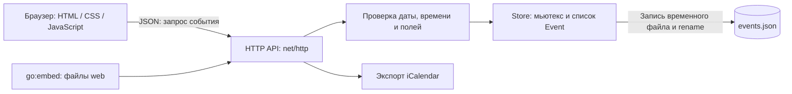

# Архитектура «Орбиты»

Браузер управляет выбранной датой, представлением, поиском и фильтрами.
Go-сервер остаётся источником истины для событий. Успешное изменение показывается
только после ответа сервера; при ошибке форма остаётся открытой с введёнными данными.

`Event` содержит идентификатор, название, календарную дату, начало и окончание,
признак полного дня, категорию, описание, место и отметку о завершении.
Состояние хранится в JSON с версией схемы `1`.

Создание и изменение проходят серверную проверку независимо от проверок формы.
Хранилище сначала сохраняет копию нового списка, затем заменяет список в памяти.
Таким образом, отказ диска не приводит к успешному ответу с несохранённым событием.

При запуске сервер читает JSON. Если файла нет, создаёт пустой календарь или,
с флагом `-demo`, пример событий. Если файл уже существует, демо-данные не добавляются.
При повреждённом JSON сервер останавливается, сохраняя исходный файл.
