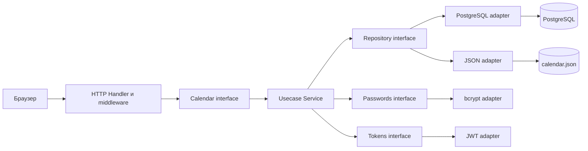
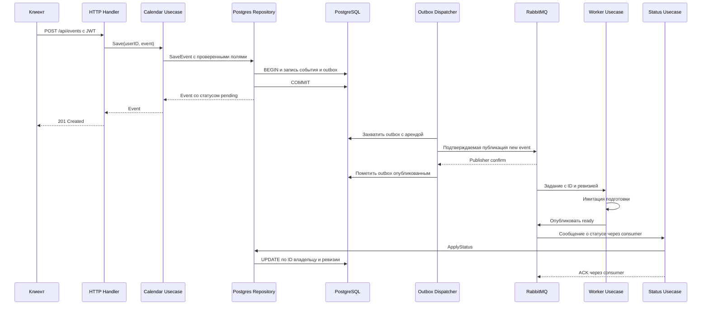

# Архитектура Орбиты

HTTP-слой обращается к интерфейсу `usecase.Calendar`. Сценарии зависят от интерфейса
`usecase.Repository`, который реализуют `repository.Postgres` и `repository.JSON`.
Модели и правила календаря находятся в `domain`, SQL и файловые операции — в адаптерах.
`main.go` соединяет реализации; он не содержит HTTP-хэндлеров или SQL-запросов.

`GET /test` проходит Handler → Service.Test → Repository.Test. В PostgreSQL-режиме
репозиторий выполняет `SELECT 'Hello!'`. POST `/dbtest` проходит ту же цепочку и
сохраняет тело строки с ID вошедшего пользователя в `database_probes`.

При входе bcrypt проверяет пароль, JWT содержит subject, jti, issuer, audience и
срок действия. Запись jti находится в `sessions`; middleware проверяет и токен,
и действительность сессии. В контекст запроса помещаются пользователь и сессия.
Список, изменение, удаление и экспорт всегда передают владельца в репозиторий.

## Асинхронная подготовка события

Аренда outbox истекает через 30 секунд. Публикация может повториться, поэтому
применение статуса идемпотентно. Ответ старой ревизии и ответ для удалённого события
не изменяют данные. Обработчик не имеет доступа к PostgreSQL и возвращает статус
через брокер; основной сервис отвечает за изменение состояния в БД.

JSON-адаптер предназначен для локального просмотра: он использует те же сценарии
и JWT, но возвращает `ready` без брокера. Старый файл первой версии не изменяется.

## Остановка и наблюдаемость

Сервер прекращает принимать новые запросы, ждёт завершения активных HTTP-запросов,
после этого останавливает фоновые процессы и закрывает соединения. Worker прекращает
потребление, ждёт текущие задачи и подтверждает только успешную публикацию результата.
Ошибки обработки возвращают доставку в очередь; неправильный формат — в dead-letter.

Prometheus собирает HTTP-счётчики, распределение времени и исходы фоновых заданий.
Метки используют шаблон маршрута, без ID событий, email и JWT. JSON-логи содержат
метод, шаблон маршрута, статус и длительность. В Grafana автоматически создаются
источник Prometheus и дашборд из восьми панелей. Генератор нагрузки ограничивает
число пользователей, частоту, время и HTTP-таймауты.
